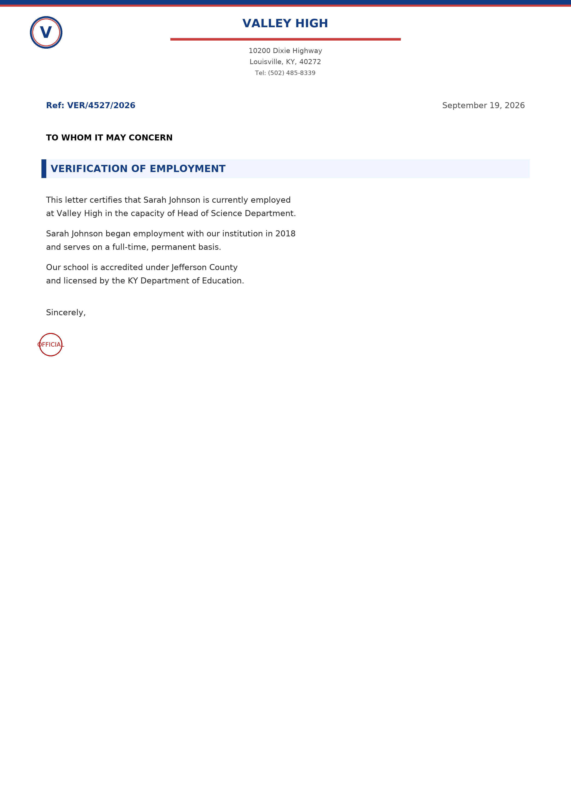
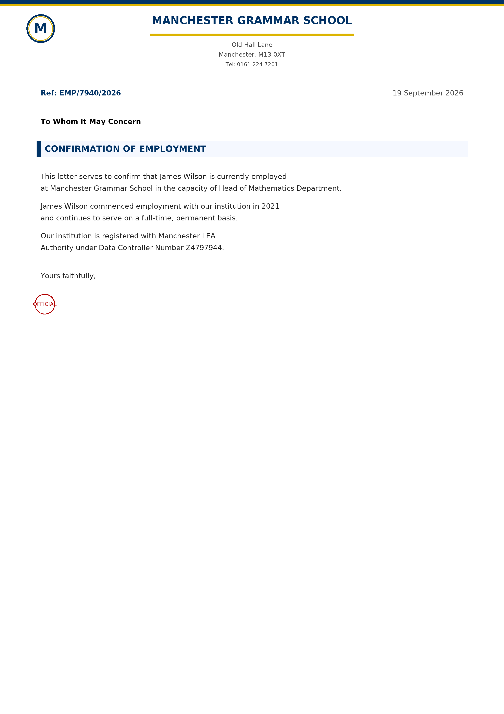

<div align="center">

# Yowes — Công Cụ Tạo Tài Liệu Canva Education

**MCP server chạy ngầm (headless)** giúp tạo giấy tờ xác minh giáo viên — thư xác nhận công tác, thẻ giáo viên, giấy phép giảng dạy, phiếu lương và nhiều loại khác — cho **13 quốc gia**.

[](LICENSE)
[](https://www.python.org/)
[](https://modelcontextprotocol.io)


*Nhỏ gọn, độc lập, cài đặt ở đâu cũng chạy.*

</div>

---

## Mục Lục

- [Ảnh mẫu](#ảnh-mẫu)
- [Tính năng](#tính-năng)
- [Các quốc gia hỗ trợ](#các-quốc-gia-hỗ-trợ)
- [Yêu cầu](#yêu-cầu)
- [Cài đặt](#cài-đặt)
- [Cách dùng — MCP server](#cách-dùng--mcp-server)
- [Giao diện GUI cũ](#giao-diện-gui-cũ)
- [Cấu trúc thư mục](#cấu-trúc-thư-mục)
- [Thêm quốc gia mới](#thêm-quốc-gia-mới)
- [Giấy phép](#giấy-phép)

---

## Ảnh mẫu

Tài liệu được xuất ra file ảnh PNG chất lượng cao. Ví dụ do công cụ này tạo:

| Thẻ giáo viên (Mỹ) | Thư xác nhận công tác (Mỹ) |
|:---:|:---:|
|  |  |

| Thẻ giáo viên (Anh) | Thư xác nhận công tác (Anh) |
|:---:|:---:|
|  |  |

---

## Tính năng

- **MCP server chạy ngầm** — tạo tài liệu thông qua tool gọi được từ AI agent qua stdio.
- **13 quốc gia**, mỗi nước có loại giấy tờ và quy cách riêng theo thực tế.
- **Dữ liệu trường học thật** gồm tên trường, địa chỉ, quận/huyện, số điện thoại.
- **Ảnh chân dung nhất quán** theo từng người — chọn ảnh theo hash, phân biệt nam/nữ.
- **Font chữ đi kèm** — dùng DejaVu Sans có sẵn, không phụ thuộc font hệ thống.
- **Đóng gói gọn nhẹ** — xuất ra file wheel tự chứa (code + ảnh + font), cài bằng 1 lệnh.

---

## Các quốc gia hỗ trợ

| Mã | Quốc gia | Các loại giấy tờ |
|------|---------|----------------|
| `uk` | Anh (United Kingdom) | employment_letter, teacher_id, teaching_license |
| `us` | Mỹ (United States) | employment_letter, teacher_id, teaching_license |
| `france` | Pháp (France) | installation_statement, iprof_screenshot, bylaws_extract, teaching_certificate |
| `netherlands` | Hà Lan (Netherlands) | employment_contract, teacher_registration, duo_declaration, school_id |
| `indonesia` | Indonesia | payslip, teaching_experience_letter, nuptk_card, appointment_letter |
| `australia` | Úc (Australia) | signed_school_letter, school_id, teaching_license |
| `canada` | Canada | oct_card, teaching_license, signed_school_letter |
| `spain` | Tây Ban Nha (Spain) | teaching_id, signed_school_letter, employment_contract |
| `argentina` | Argentina | payslip, employment_certificate, signed_school_letter |
| `slovakia` | Slovakia | payslip, employment_letter, signed_school_letter |
| `mexico` | Mexico | teaching_id, signed_school_letter, employment_certificate |
| `philippines` | Philippines | teaching_id, employment_certificate, teaching_license |
| `thailand` | Thái Lan (Thailand) | payslip, letter_of_employment |

---

## Yêu cầu

- Python **3.10 trở lên**
- Thư viện tự cài kèm theo: `Pillow`, `mcp`

---

## Cài đặt

### Cài từ file wheel build sẵn

```bash
pip install dist/yowes_doc_generator-0.1.0-py3-none-any.whl
```

### Cài từ source (chế độ sửa code trực tiếp)

```bash
pip install -e .
```

### Cài qua uv

```bash
uvx --from . yowes-mcp
```

---

## Cách dùng — MCP server

Server giao tiếp qua **MCP chuẩn stdio** — kiểu kết nối mà hầu hết agent/AI app dùng (Hermes, Claude Desktop và các MCP client khác). Bạn kết nối vào, xem danh sách tool rồi gọi thôi.

### Bước 1 — Cài đặt & kiểm tra

```bash
# cài từ file wheel
pip install dist/yowes_doc_generator-0.1.0-py3-none-any.whl

# hoặc cài từ source
pip install -e .
```

Kiểm tra cài đặt thành công và tài nguyên đi kèm (font, ảnh) đã nhận:

```bash
python -c "from countries.utils import load_font, get_profile_photo; \
print(load_font(30).getname()); print(get_profile_photo((280,340), person_id='x', gender='Male') is not None)"
# ('DejaVu Sans', 'Book')   <-- font đi kèm, không phải font hệ thống
# True                      <-- đã tìm thấy ảnh đi kèm
```

### Bước 2 — Chạy server

```bash
# Sau khi cài:
yowes-mcp

# Hoặc chạy từ source:
python mcp_server.py
```

Lệnh này sẽ đứng chờ request MCP qua stdin/stdout — đừng chạy rồi ngồi đợi nó hiện prompt gì nhé.

### Bước 3 — Khai báo vào agent / app của bạn

Trỏ MCP client tới lệnh `yowes-mcp`:

```json
{
  "mcpServers": {
    "yowes": {
      "command": "yowes-mcp",
      "args": []
    }
  }
}
```

Nếu `yowes-mcp` không có trong `PATH`, dùng đường dẫn tuyệt đối tới python và module:

```json
{
  "mcpServers": {
    "yowes": {
      "command": "/path/to/python",
      "args": ["-m", "mcp_server"]
    }
  }
}
```

### Danh sách tool

| Tool | Mô tả |
|------|-------------|
| `list_countries_tool` | Liệt kê các quốc gia, tên hiển thị và loại giấy tờ của từng nước. |
| `list_schools(country)` | Liệt kê toàn bộ trường học của 1 quốc gia theo mã nước. |
| `generate_documents(...)` | Tạo 1 hoặc nhiều giấy tờ ra file PNG, trả về đường dẫn file. |

#### `list_countries_tool()`

Không cần tham số. Trả về mỗi quốc gia 1 mục — `{ code, name, document_types }`. (Vì kiểu trả về list sẽ tách thành nhiều content item, bạn duyệt từng `content` để xem hết.)

#### `list_schools(country: str)`

- `country` *(bắt buộc)* — mã quốc gia lấy từ `list_countries_tool` (ví dụ `"us"`).
- Trả về mỗi trường 1 mục — `{ name, address, town, postcode, state, phone, lea }`. Duyệt `content` để xem hết.

#### `generate_documents(...)`

| Tham số | Kiểu | Bắt buộc | Mặc định | Mô tả |
|-----------|------|----------|---------|-------------|
| `country` | string | ✅ | — | Mã quốc gia (ví dụ `"us"`, `"uk"`). |
| `first_name` | string | ✅ | — | Tên của giáo viên. |
| `last_name` | string | ✅ | — | Họ của giáo viên. |
| `school_name` | string | ✅ | — | Tên trường (đúng hoặc gần đúng, sẽ tự khớp với danh sách trường của nước đó). |
| `position` | string | ✅ | — | Chức vụ / vị trí giảng dạy. |
| `date_of_birth` | string | ✅ | — | Ngày sinh, in lên thẻ giáo viên (ví dụ `"12/05/1988"`). |
| `gender` | string | — | `"Random"` | `"Random"`, `"Male"` hoặc `"Female"` — chọn kho ảnh chân dung. |
| `document_types` | string[] | — | tất cả | Chọn loại giấy tờ muốn tạo, ví dụ `["employment_letter", "teacher_id"]`. |
| `output_dir` | string | — | `output/` | Thư mục lưu file PNG (tính từ thư mục chạy server). |

Trả về `{ country, school, document_types, files, count, output_dir }` — `files` là đường dẫn tuyệt đối tới các file PNG.

### Kết nối từ code Python

Code client tối thiểu (cần `pip install mcp`):

```python
import asyncio
from mcp import ClientSession, StdioServerParameters
from mcp.client.stdio import stdio_client

async def main():
    params = StdioServerParameters(command="yowes-mcp", args=[])
    async with stdio_client(params) as (read, write):
        async with ClientSession(read, write) as session:
            await session.initialize()

            countries = await session.call_tool("list_countries_tool", {})
            # Kết quả list được tách thành nhiều content item:
            for item in countries.content:
                print(item.text)

            res = await session.call_tool("generate_documents", {
                "country": "us",
                "first_name": "John",
                "last_name": "Smith",
                "school_name": "Valley High",
                "position": "Head of Science Department",
                "date_of_birth": "12/05/1988",
                "gender": "Male",
            })
            print(res.content[0].text)

asyncio.run(main())
```

### Quy trình mẫu cho agent

1. Gọi `list_countries_tool` để xem có những nước nào.
2. Gọi `list_schools("us")` để chọn trường thật.
3. Gọi `generate_documents(...)` với thông tin quốc gia, trường, tên người.
4. Lấy đường dẫn PNG trả về để dùng file.

File PNG tạo ra nằm trong `output/` (hoặc thư mục `output_dir` bạn truyền vào).

---

## Giao diện GUI cũ

Vẫn còn bản giao diện tkinter (CustomTkinter) để dùng tay. Phần lõi sinh tài liệu dùng chung.

```bash
python main_gui.py        # trên Windows dùng run.bat (đã set sẵn TCL_LIBRARY)
```

> MCP server mới là giao diện chính, chạy ngầm. GUI chỉ là tùy chọn, không bắt buộc.

---

## Cấu trúc thư mục

```
yowes/
├── countries/            # Lõi sinh tài liệu (package)
│   ├── base.py           # Class cha CountryGenerator (hợp đồng chung)
│   ├── utils.py          # Font, ảnh chân dung, hàm dùng chung
│   ├── foto/             # Ảnh chân dung đi kèm (package data)
│   ├── fonts/            # Font DejaVu đi kèm (package data)
│   └── <country>/        # Mỗi quốc gia 1 package riêng
├── mcp_server.py         # MCP server chứa các tool
├── main_gui.py           # GUI tkinter bản cũ
├── docs/examples/        # Ảnh tài liệu mẫu đã tạo
├── pyproject.toml        # Đóng gói, thư viện, entry point
├── output/               # Tài liệu tạo ra (không commit lên git)
└── run.bat               # File chạy GUI trên Windows
```

---

## Thêm quốc gia mới

1. Tạo `countries/<mã_nước>/__init__.py` với class kế thừa `countries.base.CountryGenerator`.
2. Viết các hàm bắt buộc: `get_country_name`, `get_country_code`, `get_schools_data`, `get_first_names`, `get_last_names`, `get_positions`, `get_document_types`, `generate_document`.
3. Đăng ký vào `countries/__init__.py` bằng `register_country("<mã_nước>", <Tên>Generator)`.
4. (Tùy chọn) Thêm tên hiển thị trong `main_gui.py` (`get_country_list` / `on_country_change`).

Quốc gia mới sẽ tự hiện trong tool MCP `list_countries_tool` và `list_schools`.

---

## Người đóng góp

- **[quyen2867](https://github.com/quyen2867)** — tác giả & duy trì

---

## Giấy phép

[MIT](./LICENSE) © 2026 quyen2867
